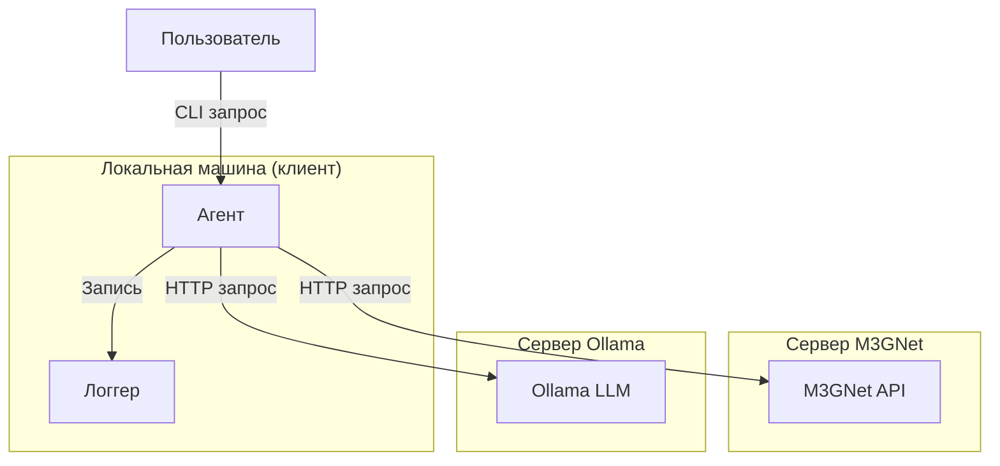
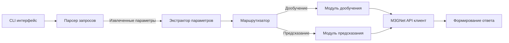
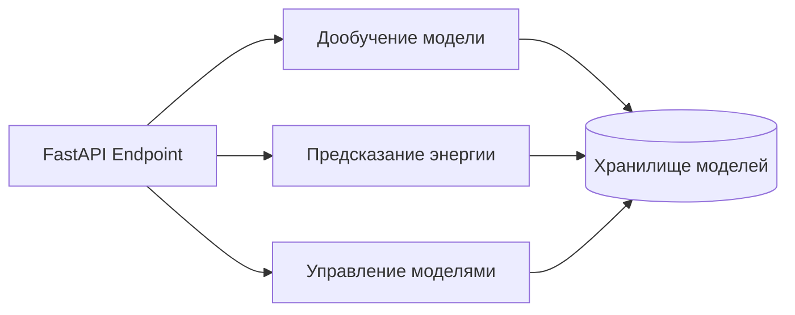
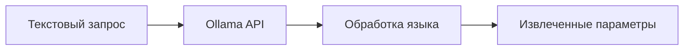
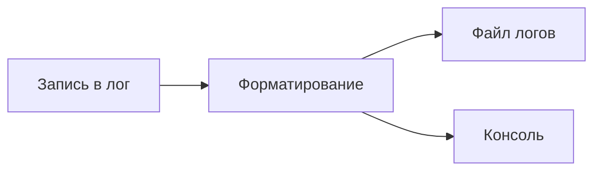
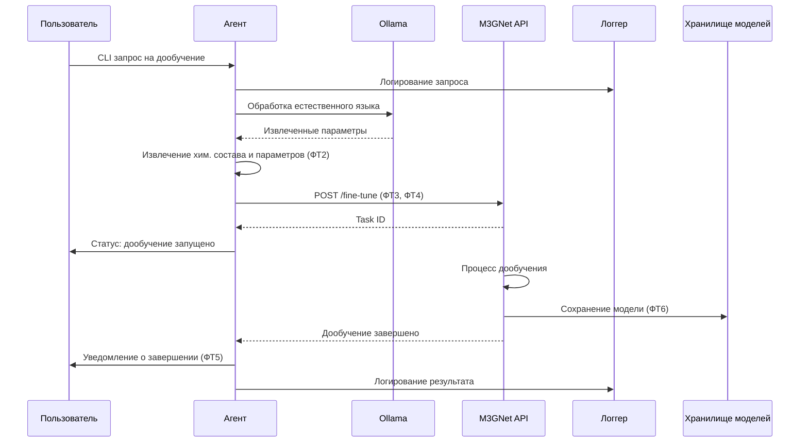
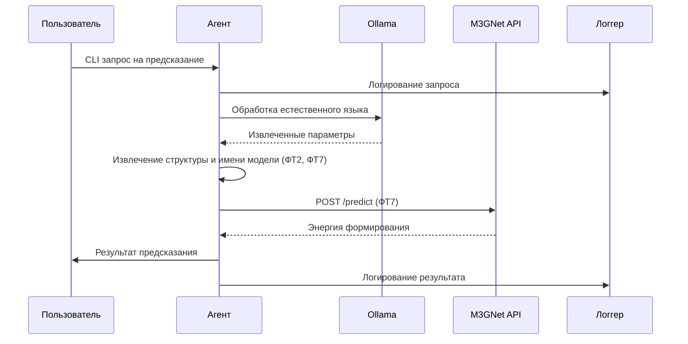
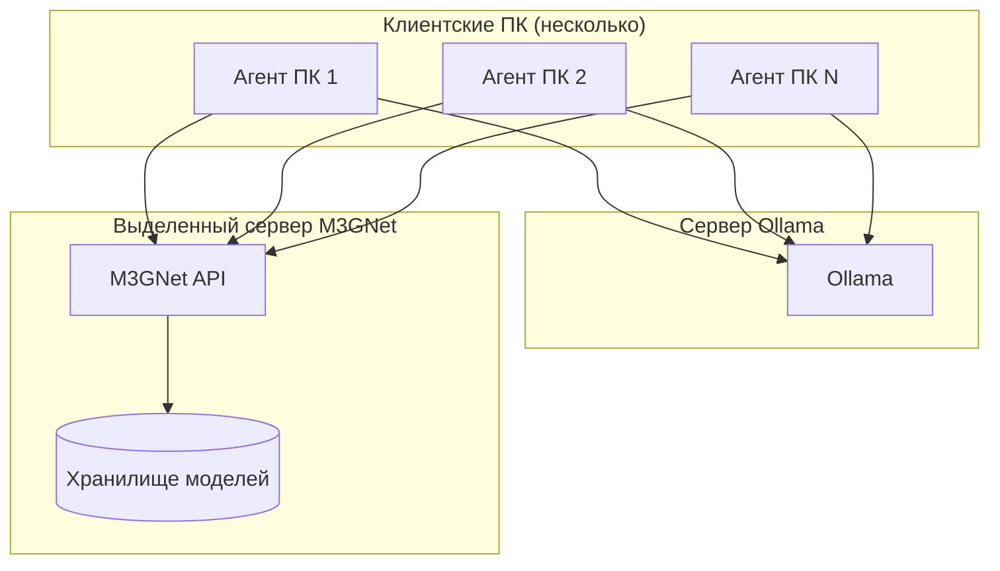

# Архитектура системы

## Обзор архитектуры

Система представляет собой модульный CLI-агент для работы с кристаллическими структурами, использующий LLM (Ollama) и M3GNet API для дообучения моделей и предсказания энергии формирования материалов.

## Компоненты системы

### 1. Агент (Agent)

Центральный компонент системы, обрабатывающий пользовательские запросы и координирующий взаимодействие с другими сервисами.

**Ответственность:**
- Приём и парсинг CLI-запросов (ФТ1)
- Извлечение ключевых параметров: химический состав, класс материалов (ФТ2)
- Маршрутизация запросов к соответствующим модулям
- Взаимодействие с M3GNet API (ФТ3, ФТ4)
- Получение статуса и результатов дообучения (ФТ5)
- Сохранение дообученной модели (ФТ6)
- Предсказание энергии формирования (ФТ7)
- Асинхронная обработка запросов (НФТ3)
- Обработка ошибок (НФТ5)
- Логирование всех операций (НФТ8)

### 2. M3GNet API (FastAPI)

REST API для работы с моделью M3GNet, развёрнутый на выделенном сервере.

**Ответственность:**
- Приём запросов на дообучение модели (ФТ3, ФТ4)
- Выполнение дообучения с переданными параметрами
- Предсказание энергии формирования материала (ФТ7)
- Сохранение и управление дообученными моделями (ФТ6)
- Возврат статуса операций (ФТ5)

### 3. Ollama LLM

Локальная внутри сети языковая модель для обработки естественного языка.

**Ответственность:**
- Обработка запросов на русском/английском языке (ФТ1)
- Помощь в извлечении ключевых параметров из запроса (ФТ2)

### 4. Логгер (Logger)

Компонент для логирования всех операций системы.

**Ответственность:**
- Логирование всех запросов (НФТ8)
- Логирование результатов операций (НФТ8)
- Логирование ошибок (НФТ5)

## Взаимодействие компонентов

### Сценарий 1: Дообучение модели

### Сценарий 2: Предсказание энергии формирования

## Развёртывание

**Особенности развёртывания:**
- Агент может запускаться на нескольких ПК (НФТ2)
- M3GNet API работает на выделенном сервере
- Ollama работает на выделенном сервере
- Все компоненты работают в изолированной сети (НФТ6)

## Технологический стек

| Компонент | Технология |
|-----------|------------|
| Агент | Python (CPU, 8-16 GB RAM) |
| M3GNet API | FastAPI |
| LLM | Ollama |
| CLI | argparse / click |
| Логирование | logging / structlog |
| Асинхронность | asyncio |

## Соответствие требованиям

| Требование | Компонент |
|------------|-----------|
| ФТ1 | Агент + Ollama |
| ФТ2 | Агент + Ollama |
| ФТ3 | Агент → M3GNet API |
| ФТ4 | Агент → M3GNet API |
| ФТ5 | Агент → M3GNet API |
| ФТ6 | M3GNet API |
| ФТ7 | Агент → M3GNet API |
| ФТ8 | Вся система |
| НФТ1 | Модульная архитектура |
| НФТ2 | Распределённое развёртывание |
| НФТ3 | asyncio |
| НФТ4 | CPU-only агент |
| НФТ5 | Обработка ошибок во всех компонентах |
| НФТ6 | Изолированная сеть |
| НФТ7 | CLI интерфейс агента |
| НФТ8 | Логгер |
